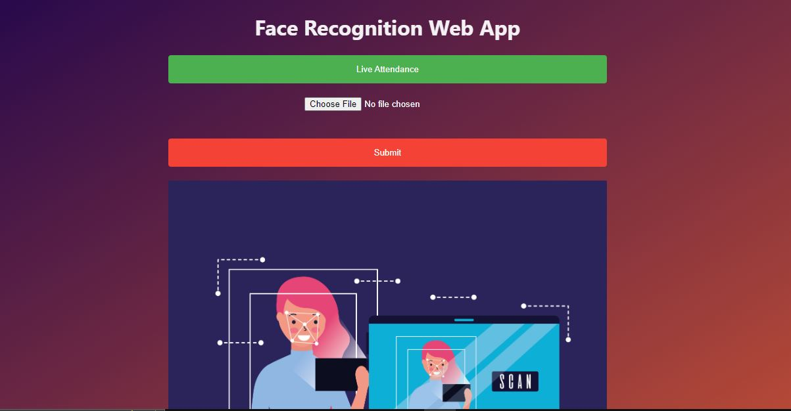
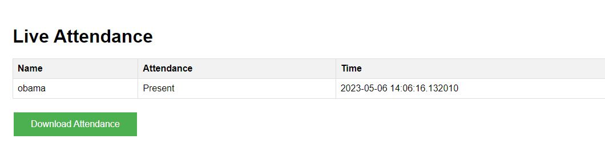

<h3>Face Recognition Attendance Tracker </h3>
This web app uses face recognition to provide real-time attendance tracking and video upload capabilities. The app is built using the Flask web framework and the face recognition module, which is a Python library for facial recognition.

<b>Features</b> 
Real-time camera attendance tracking 
Video upload attendance tracking 
Display attendance with timestamps 
Download attendance report 

<h2>How to Use</h2> 
clone the repository 
Install all the requirment 
run the app.py file 
Navigate to http://localhost:5000 in your web browser. 
To take attendance using the camera, click the "Start Camera" button. The app will automatically detect faces and mark attendance for each person. 
To upload a video for attendance tracking, click the "Upload Video" button and select the video file. The app will analyze the video and mark attendance for each person. 
To view attendance records, click the "View Attendance" button. The app will display a table with timestamps for each person. 
To download an attendance report, click the "Download Report" button. The app will generate a CSV file with attendance records and prompt you to download it. 
